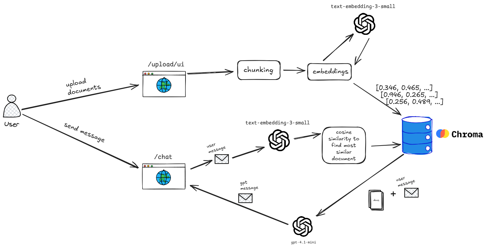

# Filespeak Backend

A FastAPI backend for document upload, storage, and chat-based querying using OpenAI and ChromaDB.  
Includes a web UI for uploading documents and a Gradio-powered chat interface for interacting with your document collection.



## How to use

1. Drag and drop or select files at `/upload/ui`
2. See uploaded files from the UI
3. Go to `/chat` to interact with your documents using natural language

## Features

- Upload and store documents (`.pdf`, `.docx`, `.txt`, `.html`) via API or web UI
- Documents are chunked and embedded using OpenAI embeddings, stored in ChromaDB
- Query your documents using natural language via a chat interface (Gradio)
- REST endpoints for listing, resetting, and querying documents
- Docker and Fly.io deployment ready

---

## Local Development

### 1. Install dependencies

```sh
poetry install
```

### 2. Set up environment variables

Copy `.env.sample` to `.env` and add your OpenAI API key:

```
OPENAI_API_KEY=your-openai-key
```

### 3. Run the server

```sh
poetry run uvicorn filespeak_backend.main:app
```

- Visit [http://localhost:8000/upload/ui](http://localhost:8000/upload/ui) for the upload UI
- Visit [http://localhost:8000/chat](http://localhost:8000/chat) for the chat interface

---

## API Endpoints

- `POST /upload` — Upload a single document
- `POST /upload_multiple` — Upload multiple documents
- `GET /ls` — List all stored document IDs
- `POST /reset` — Delete all documents from the collection
- `GET /query?query=...` — Query the collection with a text prompt

See [filespeak_backend/routers/documents.py](filespeak_backend/routers/documents.py) for details.

---

## Web UI

- Drag and drop or select files at `/upload/ui`
- See uploaded files and reset the collection from the UI

---

## Chat Interface

- Go to `/chat` to interact with your documents using natural language
- Powered by Gradio and OpenAI GPT-4

---

## Docker

Build and run with Docker:

```sh
docker build -t filespeak-backend .
docker run -p 8000:8000 --rm filespeak-backend
```

---

## Deployment (Fly.io)

1. Install [flyctl](https://fly.io/docs/hands-on/install-flyctl/)
2. Set your app name in `fly.toml` and `pyproject.toml`
3. Deploy:

```sh
fly launch
```

---

## Testing

Run tests with:

```sh
poetry run pytest
```

---

## Project Structure

```
filespeak_backend/
    main.py          # FastAPI app entrypoint
    chat.py          # Gradio chat interface
    my_chromadb.py   # ChromaDB client and collection setup
    routers/
        documents.py # Document upload/query endpoints
        ui.py        # HTML upload UI endpoint
static/
    favicon.ico
tests/
    test_ok.py
```

---

## License

MIT